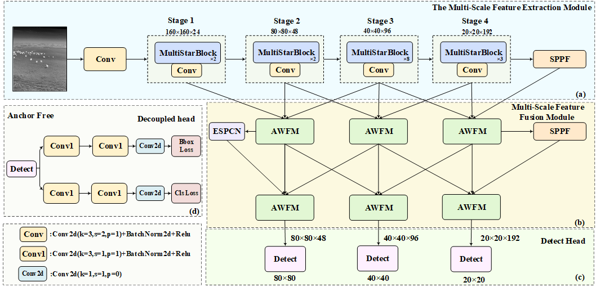

# IRAWildNet
**[ICIC2025]** IRAWildNet: A Multi-Species Infrared Wildlife Target Detection Method from the UAV Perspective

## Abstract
Multi-species animal monitoring in habitats is crucial for wildlife conservation. UAVs equipped with infrared sensors have become the mainstream method due to their ability to monitor large areas around the clock. However, due to variations in flight altitude, the same species may present significant scale differences at different distances, and different species may display similar scales. Moreover, infrared images lack color and texture details, which increases the difficulty in distinguishing similar species. Currently, research mainly focuses on single-species detection, which cannot meet practical needs. To address these issues, we collected and created a multi-species infrared wildlife dataset and proposed a network for multi-species infrared wildlife detection—IRAWildNet. This network enhances the adaptability to scale variations and morphologically similar targets through efficient multi-scale feature extraction and optimized feature fusion. The proposed MultiStarBlock module integrates global context and fine-grained local features, achieving deep interaction of multi-scale information. In the feature fusion part, the AWFM module dynamically integrates feature representations from different levels, further optimizing the expression and integration of low-level detail, mid-level structural, and high-level semantic features. Experimental results show that IRAWildNet achieves a mAP of 91.6% on our dataset, surpassing mainstream object detection models.

## Network Architecture

## Requirements
- **Python 3.9**
- **Windows10, Ubuntu18.04 or higher**
- **NVDIA GeForce RTX 4090**
- **pytorch 1.7.0 or higher**
- **More details from requirements.txt** 

## Datasets

Our dataset can be downloaded from this link.

